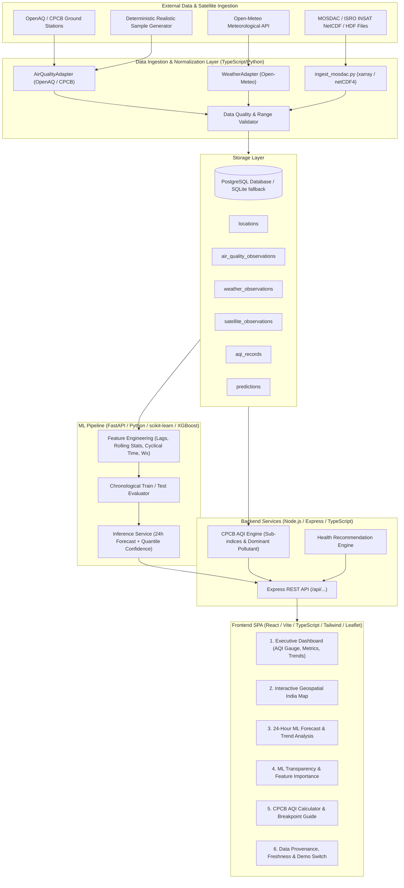

# Air Quality Insight Platform - Technical Architecture & Implementation Plan

A production-quality, scientifically grounded **Air Quality Insight Platform** combining real-time ground observations, meteorological & satellite contextual data (MOSDAC/ISRO NetCDF), machine learning forecasting (XGBoost / Random Forest), geospatial visualization across India, and evidence-based health insights.

---

## 1. Requirement Analysis & Technical Nuances

### 1.1 Indian AQI Methodology (CPCB Standard)
* **Standard**: Central Pollution Control Board (CPCB) National Air Quality Index guidelines (2014/2015).
* **Pollutants**: PM2.5 (24h avg), PM10 (24h avg), NO2 (24h avg), SO2 (24h avg), CO (8h avg in $\text{mg/m}^3$), O3 (8h avg), NH3 (24h avg), Pb (24h avg).
* **Calculation Math**: 
  $$I_p = I_{\text{low}} + \frac{I_{\text{high}} - I_{\text{low}}}{B_{\text{high}} - B_{\text{low}}} \times (C_p - B_{\text{low}})$$
* **Aggregation Rule**: $AQI = \max_{p}(I_p)$.
* **Validity Criteria**: CPCB mandates that AQI is valid **only** if at least **3 pollutants** are measured, and at least one of them **MUST be PM2.5 or PM10**.
* **Categories & Color Palette**:
  - **Good (0–50)**: Green `#10B981` — Minimal impact.
  - **Satisfactory (51–100)**: Light Green `#84CC16` — Minor breathing discomfort to sensitive people.
  - **Moderate (101–200)**: Yellow/Amber `#F59E0B` — Breathing discomfort to people with asthma and heart diseases.
  - **Poor (201–300)**: Orange `#F97316` — Breathing discomfort to most people on prolonged exposure.
  - **Very Poor (301–400)**: Red/Crimson `#EF4444` — Respiratory illness on prolonged exposure.
  - **Severe (401–500+)**: Purple/Maroon `#7F1D1D` — Affects healthy people and seriously impacts those with existing diseases.

### 1.2 Scientific Integrity & Satellite/Meteorological Constraints
* **INSAT / MOSDAC Policy**: INSAT-3D/3DR/3DS satellites measure radiance, brightness temperature, cloud properties, and derived **Aerosol Optical Depth (AOD)** — they do **not** directly measure ground-level AQI or ground PM2.5.
* **AOD as Contextual Feature**: Satellite AOD and meteorological parameters (Boundary Layer Height, Relative Humidity, Wind vectors, Temperature) will be ingested and treated strictly as **contextual/environmental covariates** in the ML pipeline.
* **No Fabrications**: Real public APIs (OpenAQ v2/v3, Open-Meteo) and reproducible mock/demo datasets will be distinctively labeled with timestamps, source origins, and data quality metrics.

---

## 2. System Architecture



---

## 3. Database Schema

### `locations`
- `id`: VARCHAR(64) PRIMARY KEY (e.g., `delhi-anand-vihar`, `mumbai-bandra`)
- `name`: VARCHAR(255) NOT NULL
- `city`: VARCHAR(100) NOT NULL
- `state`: VARCHAR(100) NOT NULL
- `country`: VARCHAR(10) DEFAULT 'IN'
- `latitude`: DOUBLE PRECISION NOT NULL
- `longitude`: DOUBLE PRECISION NOT NULL
- `elevation`: DOUBLE PRECISION
- `station_type`: VARCHAR(50) (e.g., `CAAQMS_URBAN`, `INDUSTRIAL`, `BACKGROUND`)

### `air_quality_observations`
- `id`: BIGSERIAL PRIMARY KEY
- `location_id`: VARCHAR(64) REFERENCES locations(id)
- `timestamp`: TIMESTAMPTZ NOT NULL
- `pm25`: DOUBLE PRECISION (µg/m³)
- `pm10`: DOUBLE PRECISION (µg/m³)
- `no2`: DOUBLE PRECISION (µg/m³)
- `so2`: DOUBLE PRECISION (µg/m³)
- `co`: DOUBLE PRECISION (mg/m³)
- `o3`: DOUBLE PRECISION (µg/m³)
- `nh3`: DOUBLE PRECISION (µg/m³)
- `source`: VARCHAR(50) NOT NULL (e.g., `CPCB`, `OpenAQ`, `DEMO_SIMULATION`)
- `data_quality_score`: DOUBLE PRECISION (0.0 to 1.0)
- `is_validated`: BOOLEAN DEFAULT TRUE

### `weather_observations`
- `id`: BIGSERIAL PRIMARY KEY
- `location_id`: VARCHAR(64) REFERENCES locations(id)
- `timestamp`: TIMESTAMPTZ NOT NULL
- `temperature`: DOUBLE PRECISION (°C)
- `relative_humidity`: DOUBLE PRECISION (%)
- `surface_pressure`: DOUBLE PRECISION (hPa)
- `wind_speed`: DOUBLE PRECISION (m/s)
- `wind_direction`: DOUBLE PRECISION (degrees)
- `rainfall`: DOUBLE PRECISION (mm)
- `cloud_cover`: DOUBLE PRECISION (%)
- `boundary_layer_height`: DOUBLE PRECISION (m)
- `source`: VARCHAR(50) NOT NULL (e.g., `OPEN_METEO`, `IMD`)

### `satellite_observations`
- `id`: BIGSERIAL PRIMARY KEY
- `timestamp`: TIMESTAMPTZ NOT NULL
- `latitude`: DOUBLE PRECISION NOT NULL
- `longitude`: DOUBLE PRECISION NOT NULL
- `product`: VARCHAR(50) (e.g., `INSAT_3D_L2_AOD`, `MODIS_AOD`)
- `variable_name`: VARCHAR(50) (e.g., `aerosol_optical_depth_550nm`)
- `value`: DOUBLE PRECISION NOT NULL
- `quality_flag`: INTEGER
- `source_file`: VARCHAR(255)

### `aqi_records`
- `id`: BIGSERIAL PRIMARY KEY
- `location_id`: VARCHAR(64) REFERENCES locations(id)
- `timestamp`: TIMESTAMPTZ NOT NULL
- `aqi`: INTEGER NOT NULL
- `category`: VARCHAR(50) NOT NULL
- `dominant_pollutant`: VARCHAR(20) NOT NULL
- `methodology`: VARCHAR(50) DEFAULT 'CPCB_INDIA_2014'
- `sub_indices`: JSONB NOT NULL
- `pollutant_count`: INTEGER NOT NULL

### `predictions`
- `id`: BIGSERIAL PRIMARY KEY
- `location_id`: VARCHAR(64) REFERENCES locations(id)
- `generated_at`: TIMESTAMPTZ NOT NULL
- `target_timestamp`: TIMESTAMPTZ NOT NULL
- `forecast_step_hours`: INTEGER NOT NULL
- `predicted_pm25`: DOUBLE PRECISION NOT NULL
- `predicted_aqi`: INTEGER NOT NULL
- `predicted_category`: VARCHAR(50) NOT NULL
- `lower_bound_pm25`: DOUBLE PRECISION
- `upper_bound_pm25`: DOUBLE PRECISION
- `model_version`: VARCHAR(50) NOT NULL
- `model_type`: VARCHAR(50) NOT NULL

---

## 4. Machine Learning Forecasting Architecture

### 4.1 Prediction Objective
Forecast hourly $PM_{2.5}$ for $t+1$ to $t+24$ hours ahead, and compute derived AQI category progression.

### 4.2 Feature Pipeline
1. **Temporal Features**:
   - $\sin(2\pi \times \text{hour}/24)$, $\cos(2\pi \times \text{hour}/24)$
   - $\sin(2\pi \times \text{dayofweek}/7)$, $\cos(2\pi \times \text{dayofweek}/7)$
   - $\sin(2\pi \times \text{month}/12)$, $\cos(2\pi \times \text{month}/12)$
   - Is weekend / Indian national holiday flag
2. **Lagged Pollutant Features**:
   - $PM2.5_{t-1}, PM2.5_{t-2}, PM2.5_{t-3}, PM2.5_{t-6}, PM2.5_{t-12}, PM2.5_{t-24}$
   - $PM10_{t-1}, NO2_{t-1}$
3. **Rolling Aggregate Features**:
   - Rolling 3h, 6h, 12h, 24h: Mean, Standard Deviation, Min, Max, Trend Slope ($\Delta_{3h} = \bar{X}_{3h} - \bar{X}_{6h}$)
4. **Meteorological Covariates (Forecast + Real-time)**:
   - Temperature, Relative Humidity, Pressure, Precipitation
   - Wind speed & decomposed wind components: $u = -ws \cdot \sin(\theta)$, $v = -ws \cdot \cos(\theta)$
   - Ventilation Index proxy: $(\text{Wind Speed} \times \text{Boundary Layer Height})$
5. **Spatial Context**:
   - Station Latitude, Longitude, Urban density index / elevation.

### 4.3 Evaluation & Validation Strategy
* **Strict Chronological Splitting**: 
  - Train: First 70% of chronological timeline
  - Validation: Next 15% (hyperparameter tuning)
  - Test: Final 15% (held-out out-of-time evaluation)
  - **No random shuffling** to prevent temporal data leakage.
* **Metrics**: MAE, RMSE, MAPE, $R^2$, and AQI Category Classification Accuracy.
* **Uncertainty Quantification**: Empirical quantile residuals ($q_{0.10}$ and $q_{0.90}$) to produce scientifically honest prediction intervals instead of synthetic random percentages.

---

## 5. MOSDAC / ISRO NetCDF Ingestion Architecture

A standalone Python pipeline (`scripts/ingest_mosdac.py` & `backend/src/services/mosdacService.ts`) with:
1. Support for `.nc` (NetCDF-4) and `.h5` (HDF5) files using `xarray` / `netCDF4` / `h5py`.
2. Inspects dataset metadata, coordinate reference systems, and variable dimensions.
3. Automatically maps standard ISRO/MOSDAC variable keys (e.g., `AOD_550`, `AEROSOL_OPTICAL_DEPTH`, `Optical_Depth_055`, `latitude`, `longitude`, `time`).
4. Extracts spatial bounding boxes for Indian subcontinent $[6^\circ N - 38^\circ N, 68^\circ E - 98^\circ E]$.
5. Nearest-neighbor / bilinear interpolation for station coordinates.
6. Handles missing values / fill values (`_FillValue`, `NaN`, `-999`).
7. Outputs normalized structured records to database / JSON / CSV.
8. Includes synthetic sample NetCDF generator for local end-to-end testing without external network dependencies.

---

## 6. Project Structure

```
air-quality-platform/
├── package.json
├── docker-compose.yml
├── .env.example
├── README.md
│
├── frontend/
│   ├── index.html
│   ├── package.json
│   ├── vite.config.ts
│   ├── tsconfig.json
│   ├── tailwind.config.js
│   └── src/
│       ├── main.tsx
│       ├── App.tsx
│       ├── index.css
│       ├── types/
│       │   ├── aqi.ts
│       │   ├── observation.ts
│       │   ├── forecast.ts
│       │   └── map.ts
│       ├── services/
│       │   ├── api.ts
│       │   └── mockData.ts
│       ├── components/
│       │   ├── layout/
│       │   │   ├── Navbar.tsx
│       │   │   ├── Footer.tsx
│       │   │   └── DataSourceBanner.tsx
│       │   ├── dashboard/
│       │   │   ├── AqiHeroGauge.tsx
│       │   │   ├── PollutantCard.tsx
│       │   │   ├── WeatherCard.tsx
│       │   │   ├── DiurnalTrendChart.tsx
│       │   │   └── HealthAdvisoryCard.tsx
│       │   ├── map/
│       │   │   ├── IndiaAirMap.tsx
│       │   │   ├── StationPopup.tsx
│       │   │   └── LayerSelector.tsx
│       │   ├── forecast/
│       │   │   ├── ForecastTimelineChart.tsx
│       │   │   ├── PredictedCategoryCard.tsx
│       │   │   └── UncertaintyBandChart.tsx
│       │   ├── ml/
│       │   │   ├── FeatureImportancePlot.tsx
│       │   │   ├── ModelMetricsCard.tsx
│       │   │   └── ResidualHistogram.tsx
│       │   └── aqi-guide/
│       │       ├── CpcbBreakdownTable.tsx
│       │       └── SubIndexCalculator.tsx
│       └── pages/
│           ├── DashboardPage.tsx
│           ├── MapExplorerPage.tsx
│           ├── ForecastPage.tsx
│           ├── ModelTransparencyPage.tsx
│           ├── AqiMethodologyPage.tsx
│           └── DataProvenancePage.tsx
│
├── backend/
│   ├── package.json
│   ├── tsconfig.json
│   ├── database/
│   │   ├── schema.sql
│   │   └── seed.sql
│   └── src/
│       ├── server.ts
│       ├── app.ts
│       ├── config/
│       │   └── env.ts
│       ├── types/
│       │   └── index.ts
│       ├── aqi/
│       │   ├── indianAQI.ts
│       │   ├── breakpoints.ts
│       │   └── classification.ts
│       ├── health/
│       │   └── healthEngine.ts
│       ├── providers/
│       │   ├── baseProvider.ts
│       │   ├── openAqAdapter.ts
│       │   ├── openMeteoAdapter.ts
│       │   ├── cpcbAdapter.ts
│       │   └── demoDataProvider.ts
│       ├── services/
│       │   ├── airQualityService.ts
│       │   ├── weatherService.ts
│       │   ├── mosdacService.ts
│       │   └── mlClientService.ts
│       ├── controllers/
│       │   ├── aqiController.ts
│       │   ├── observationController.ts
│       │   ├── forecastController.ts
│       │   └── metadataController.ts
│       └── routes/
│           └── apiRoutes.ts
│
├── ml/
│   ├── requirements.txt
│   ├── Dockerfile
│   ├── app/
│   │   ├── main.py
│   │   ├── schemas.py
│   │   ├── prediction.py
│   │   └── preprocessing.py
│   ├── training/
│   │   ├── dataset_builder.py
│   │   ├── features.py
│   │   ├── train.py
│   │   └── evaluate.py
│   └── models/
│       └── metadata.json
│
├── scripts/
│   ├── ingest_mosdac.py
│   ├── generate_sample_satellite_nc.py
│   ├── seed_database.py
│   └── run_full_pipeline.bat
│
└── docs/
    ├── architecture.md
    ├── cpcb_aqi_methodology.md
    ├── ml_pipeline.md
    ├── mosdac_ingestion.md
    └── api_specification.md
```

---

## 7. Implementation Phases

### Phase 1: Architecture, Core Engine & Mathematical Foundation
- Create repository scaffolding (`frontend`, `backend`, `ml`, `scripts`, `docs`).
- Implement exact CPCB 2014 AQI sub-index mathematical engine with full unit tests covering all 8 pollutants, breakpoint edges, and validity conditions.
- Implement Health Recommendation Engine with granular contextual guidelines.

### Phase 2: Backend API, Adapters & Data Ingestion
- Implement Express + TypeScript backend with clean provider adapters (OpenAQ, Open-Meteo, CPCB, Demo/Mock provider).
- Implement database models and SQL schemas.
- Implement data quality validator (range checks, stale data warnings, completeness score).
- Expose REST API endpoints with request/response Zod validation.

### Phase 3: ML Forecasting Engine & FastAPI Service
- Implement Python ML pipeline: feature engineering (cyclical time, lags, rolling windows, wind decomposition).
- Implement training & evaluation scripts with strict chronological out-of-time splits (MAE, RMSE, $R^2$, empirical residual intervals).
- Build FastAPI inference server (`ml/app/main.py`) with fallback heuristic inference when Python environment runs in lightweight mode.

### Phase 4: MOSDAC / ISRO Satellite Ingestion System
- Implement `scripts/ingest_mosdac.py` using `xarray` / `netCDF4` to ingest AOD and meteorological products.
- Create `scripts/generate_sample_satellite_nc.py` to create real `.nc` test files.
- Integrate satellite data into the backend service layer.

### Phase 5: High-Aesthetics Frontend Application
- Build React + Vite + Tailwind CSS + Lucide + Recharts frontend with glassmorphic dark theme and rich visual hierarchy.
- **Views**:
  1. Executive Dashboard (Hero AQI gauge, pollutant cards with sub-indices, 24h trends, weather).
  2. Geospatial Map with Leaflet / MapLibre (India station markers, layer toggles, popup analytics).
  3. 24-Hour ML Forecast (trajectory, uncertainty bounds, trend classifier).
  4. ML Transparency (feature importance, loss curves, dataset provenance).
  5. CPCB Calculator & Breakpoint Guide (interactive what-if tool).
  6. Data Provenance & Real vs. Demo toggle.

### Phase 6: Automated Testing, Validation & Documentation
- Comprehensive test suite for AQI calculations, feature engineering, and API endpoints.
- Full technical documentation in `docs/` and `README.md`.
- End-to-end integration and build verification.

---

## 8. Verification Plan

### Automated Tests
1. **AQI Calculation Unit Tests**:
   - Test each pollutant at boundary breakpoints (e.g., PM2.5 = 30 -> 50, 60 -> 100, 90 -> 200).
   - Test multi-pollutant maximum logic.
   - Test invalid condition (e.g., only 2 pollutants or missing PM2.5/PM10 -> flag incomplete).
2. **Backend API Integration Tests**:
   - Test `/api/locations`, `/api/air-quality/current`, `/api/aqi`, `/api/forecast`, `/api/health-recommendation`.
3. **ML Pipeline Tests**:
   - Validate lag creation, no future leakage in feature transforms, non-random chronological split.
4. **MOSDAC Ingestion Tests**:
   - Ingest generated NetCDF file, verify grid extraction, coordinate mapping, and missing value handling.
5. **Frontend Build & Lint Checks**:
   - `npm run build` for frontend and backend TypeScript compilation.

### Manual Verification
- Browser testing: Verify responsiveness, interactive map zooming/selection, station popup analytics, real/demo toggle, forecast chart rendering, and sub-index calculation accuracy.
